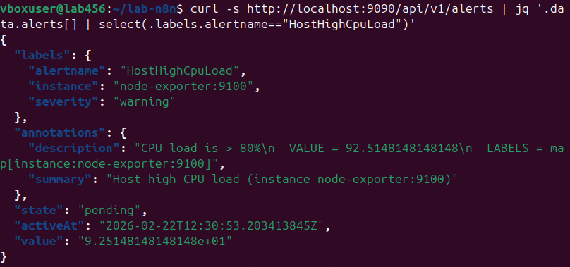
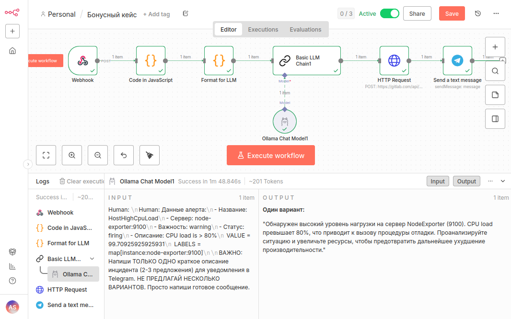
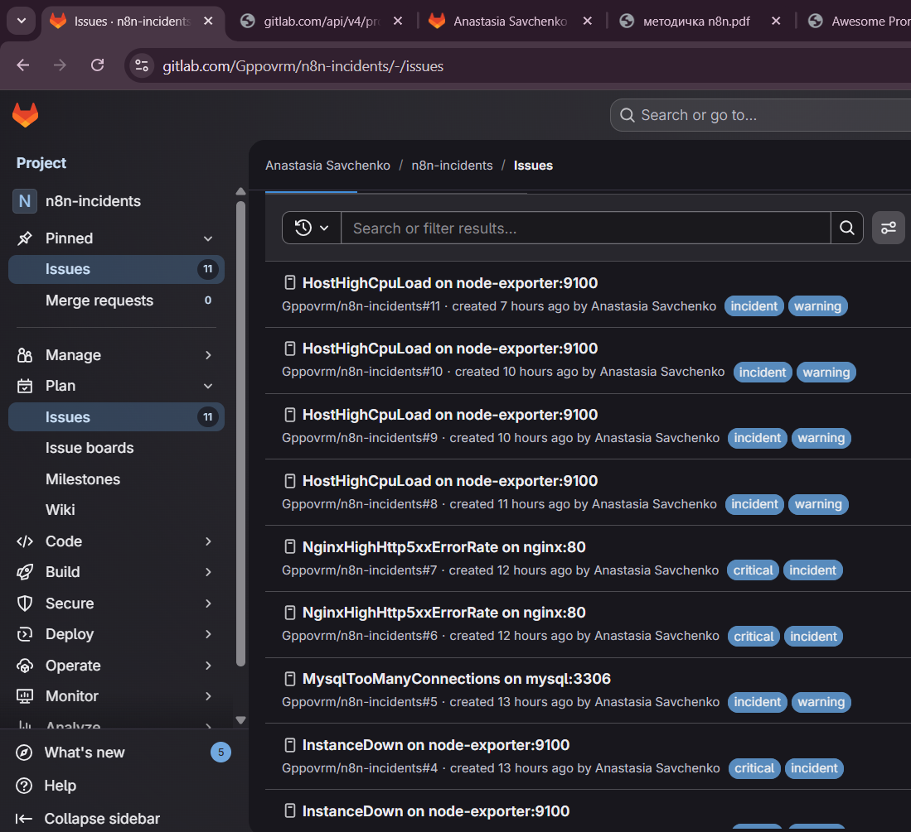
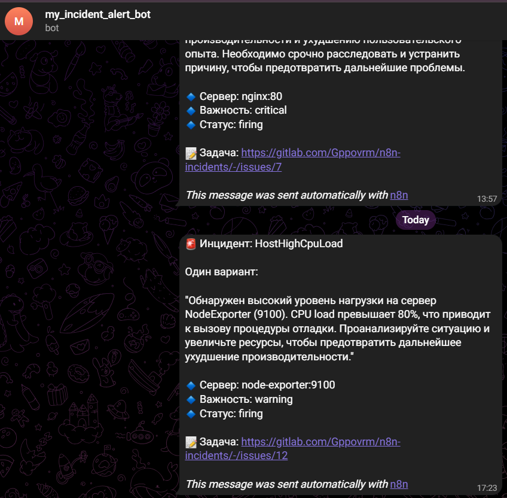

### **Кейс № 7: Локальный LLM-чат с n8n и Ollama**

**Цель:** Дать команде ML-инженеров возможность не зависеть от внешних веб-сервисов, а также модифицировать и
устанавливать свои локальные модели и работать с ними.

**Выполнение:**

✅ **Чекпоинт 1: Установка Postgres, Redis, n8n, Ollama**

- Linux (Ubuntu 24.04)
- Docker + Docker Compose
  Все 4 Docker образа - загружены:
- postgres:15-alpine - 274MB
- redis:7-alpine - 41.4MB
- ollama/ollama:0.13.4 - 3.95GB
- Создана отдельная директория проекта командой `mkdir lab-n8n && cd lab-n8n`
- Сгенерирован ключ шифрования для n8n командой `openssl rand -hex 32`
- Создан файл `.env` с переменными окружения:
  ```
  N8N_ENCRYPTION_KEY=<результат команды openssl rand -hex 32>
  POSTGRES_PASSWORD=postgres
  REDIS_PASSWORD=redis
  GENERIC_TIMEZONE=Europe/Moscow
  ```
- На основе официальной документации n8n (https://docs.n8n.io/hosting/installation/server-setups/docker-compose/) создан
  файл `docker-compose.yml` со следующими модификациями:
    - Убран Traefik (замена https на http)
    - Замена SQLite на PostgreSQL
    - Добавлен контейнер Redis для очередей воркеров
    - Добавлен второй контейнер n8n-worker для реализации Queue mode
    - Добавлена переменная N8N_ENCRYPTION_KEY
- Запущены все контейнеры командой `docker compose up -d`
- Проверена работоспособность командой `docker compose ps`

✅ **Чекпоинт 2: Подключение Postgres и Redis к n8n**

- В `docker-compose.yml` настроены сервисы:
  ``` yaml
  postgres:
    image: postgres:15-alpine
    container_name: lab_postgres
    environment:
      - POSTGRES_USER=postgres
      - POSTGRES_PASSWORD=${POSTGRES_PASSWORD}
      - POSTGRES_DB=n8n
  
  redis:
    image: redis:7-alpine
    container_name: lab_redis
    command: redis-server --requirepass ${REDIS_PASSWORD}
  ```
- В конфигурации `n8n-main` и `n8n-worker` прописаны параметры подключения к БД:
    - `DB_TYPE=postgresdb`
    - `DB_POSTGRESDB_HOST=postgres`
    - `QUEUE_BULL_REDIS_HOST=redis`
    - Пароли передаются через переменные окружения из `.env`

✅ **Чекпоинт 3: Добавление Ollama и загрузка модели**

- В манифест Docker Compose добавлен контейнер:
  ``` yaml
  ollama:
    image: ollama/ollama:0.13.4
    container_name: lab_ollama
    volumes:
      - ollama_data:/root/.ollama
    ports:
      - "11434:11434"
  ```
- Выполнен вход в контейнер: `docker exec -it lab_ollama /bin/sh`
- Загружена модель `gemma3:1b` командой `ollama pull gemma3:1b` (размер ~1.5GB)
- Проверена загрузка командой `ollama list`
- Выход из контейнера: `exit`

✅ **Чекпоинт 4: Настройка кредов в n8n для Ollama**

- В веб-интерфейсе n8n (http://localhost:5678) выполнена регистрация
- В разделе Credentials создан новый credential типа Ollama
- Указан endpoint: `http://lab_ollama:11434` (по имени контейнера)
- Также настроены credentials для Redis с использованием пароля `redis` как указано в Redis документации

✅ **Чекпоинт 5: Создание воркфлоу с памятью Redis**

- Создан новый workflow в n8n
- Настроена нода OpenAI Chat Model:
    - Credential: созданный ранее Ollama credential
    - Модель: `gemma3:1b`
- Построена цепочка: **Chat Message → AI Agent → Chat Model (Ollama)**
- К AI Agent добавлена память Redis для сохранения контекста диалога (выбрана нода Redis Chat Memory)

### Результат

СКРИН И ОПИСАНИЕ!!!!!!!!!!!!!!!!!!

---

### **Призовой Кейс: AIOps/ChatOps поверх Prometheus**

**Цель:** Построить базовый AIOps‑ и ChatOps‑слой поверх Prometheus, который ускоряет реакцию на инциденты, уменьшает
рутину для дежурных и создает основу для дальнейшей автоматизации (корреляция алертов, авто‑диагностика, рекомендации по
устранению).

**Выполнение:**

✅ **Чекпоинт 1: Развертывание Node Exporter, Prometheus и Alertmanager**

- В `docker-compose.yml` добавлены сервисы:
  ``` yaml
  node-exporter:
    image: prom/node-exporter:latest
    container_name: node-exporter
    ports:
      - "9100:9100"
  
  prometheus:
    image: prom/prometheus:latest
    container_name: prometheus
    ports:
      - "9090:9090"
    volumes:
      - ./prometheus.yml:/etc/prometheus/prometheus.yml
      - ./alerts.yml:/etc/prometheus/alerts.yml
  
  alertmanager:
    image: prom/alertmanager:latest
    container_name: alertmanager
    ports:
      - "9093:9093"
    volumes:
      - ./alertmanager.yml:/etc/alertmanager/alertmanager.yml
  ```
- Все сервисы объединены в общую сеть `n8n_network`

✅ **Чекпоинт 2: Добавление алертов с Awesome Prometheus Alerts**

- Создан файл `alerts.yml` с правилами алертов с сайта Awesome Prometheus Alerts:
  ``` yaml
  groups:
    - name: nginx_alerts
      rules:
        - alert: NginxHighHttp5xxErrorRate
          expr: sum(rate(nginx_http_requests_total{status=~"^5.."}[1m])) / sum(rate(nginx_http_requests_total[1m])) * 100 > 5
          for: 1m
          labels:
            severity: critical
          annotations:
            summary: "Nginx high HTTP 5xx error rate (instance {{ $labels.instance }})"
            description: "Too many HTTP requests with status 5xx (> 5%)\n  VALUE = {{ $value }}\n  LABELS = {{ $labels }}"
    
    - name: host_alerts
      rules:
        - alert: HostOutOfMemory
          expr: (node_memory_MemAvailable_bytes / node_memory_MemTotal_bytes < 0.1)
          for: 2m
          labels:
            severity: warning
          annotations:
            summary: "Host out of memory (instance {{ $labels.instance }})"
            description: "Node memory is filling up (< 10% left)\n  VALUE = {{ $value }}\n  LABELS = {{ $labels }}"
        
        - alert: HostHighCpuLoad
          expr: 100 - (avg by (instance) (rate(node_cpu_seconds_total{mode="idle"}[1m])) * 100) > 80
          for: 10s
          labels:
            severity: warning
          annotations:
            summary: "Host high CPU load (instance {{ $labels.instance }})"
            description: "CPU load is > 80%\n  VALUE = {{ $value }}\n  LABELS = {{ $labels }}"
  ```
- Правила подключены в `prometheus.yml` через `rule_files: - "alerts.yml"`

✅ **Чекпоинт 3: Создание workflow с Webhook-нодой**

- В n8n создан новый workflow
- Добавлена Webhook-нода с путем `alert`
- Настроена на прием POST-запросов с payload от Alertmanager

✅ **Чекпоинт 4: Настройка Alertmanager на отправку в n8n**

- Создан файл `alertmanager.yml` с конфигурацией:
  ``` yaml
  route:
    group_by: ['alertname']
    group_wait: 10s
    group_interval: 10s
    repeat_interval: 1h
    receiver: 'n8n-webhook'
  
  receivers:
  - name: 'n8n-webhook'
    webhook_configs:
    - url: 'http://n8n-main:5678/webhook-test/alert'
      send_resolved: true
  ```
- В `docker-compose.yml` добавлен volume для монтирования конфига

✅ **Чекпоинт 5: Парсинг payload алерта**

- Добавлена нода **Code in JavaScript**, которая извлекает ключевые параметры:
  ```javascript
  const alertData = $input.first().json.body;
  if (alertData && alertData.alerts && alertData.alerts.length > 0) {
    const alert = alertData.alerts[0];
    return {
      alertname: alert.labels?.alertname || 'Unknown',
      instance: alert.labels?.instance || 'Unknown',
      severity: alert.labels?.severity || 'unknown',
      status: alert.status || 'firing',
      summary: alert.annotations?.summary || '',
      description: alert.annotations?.description || '',
      startsAt: alert.startsAt || ''
    };
  }
  ```

✅ **Чекпоинт 6: LLM-нода для формирования описания**

- Добавлена нода **Format for LLM**, формирующая промпт:
  ```
  Данные алерта:
  - Название: {{alertname}}
  - Сервер: {{instance}}
  - Важность: {{severity}}
  - Статус: {{status}}
  - Описание: {{description}}
  
  ВАЖНО: Напиши ТОЛЬКО ОДНО краткое описание инцидента (2-3 предложения) для уведомления в Telegram. НЕ ПРЕДЛАГАЙ НЕСКОЛЬКО ВАРИАНТОВ.
  ```
- Нода **Basic LLM Chain1** (Ollama с моделью `gemma3:1b`) генерирует человекочитаемое описание

✅ **Чекпоинт 7: Получение кредов от бота**

- В Telegram найден бот @BotFather
- Создан новый бот командой `/newbot`
- Указано имя: `my_incident_alert_bot`
- Получен токен: `<ТОКЕН>`
- Для получения Chat ID отправлено сообщение боту
- Выполнен запрос к Telegram API:
  ``` bash
  curl https://api.telegram.org/bot<ТОКЕН>/getUpdates
  ```
- В ответе получен JSON, где найден `"chat":{"id":<chat.id>}` — это личный ID пользователя

✅ **Чекпоинт 8: Создание задачи в GitLab**

- Создан публичный проект на GitLab.com: https://gitlab.com/Gppovrm/n8n-incidents
- В n8n добавлена нода **HTTP Request** с настройками:
    - Method: POST
    - URL: `https://gitlab.com/api/v4/projects/Gppovrm%2Fn8n-incidents/issues`
    - Headers: `PRIVATE-TOKEN` (сгенерирован в настройках GitLab)
    - Body (JSON):
      ``` json
      {
        "title": "{{$node['Code in JavaScript'].json.alertname}} on {{$node['Code in JavaScript'].json.instance}}",
        "description": {{JSON.stringify($node['Basic LLM Chain1'].json.text)}},
        "labels": "incident,{{$node['Code in JavaScript'].json.severity}}"
      }
      ```

✅ **Чекпоинт 9: Отправка уведомления в Telegram**

- В n8n добавлена нода **Telegram** с настройками:
    - Credential: созданный ранее Telegram бот
    - Resource: Message
    - Operation: Send Chat Message
    - Chat ID: `1162734191` (полученный через API)
    - Text (expression):
      ```
      🚨 Инцидент: {{ $node['Code in JavaScript'].json.alertname }}
      
      {{ $node['Basic LLM Chain1'].json.text }}
      
      🔹 Сервер: {{ $node['Code in JavaScript'].json.instance }}
      🔹 Важность: {{ $node['Code in JavaScript'].json.severity }}
      🔹 Статус: {{ $node['Code in JavaScript'].json.status }}
      
      📝 Задача: {{ $json.web_url }}
      ```

### **Проверка работоспособности**

Для проверки работы пайплайна создавалась нагрузка на процессор с помощью утилиты `stress`:

```bash
stress --cpu $(nproc) --timeout 60
```

Во время нагрузки отслеживался статус алерта в Prometheus:

```bash
curl -s http://localhost:9090/api/v1/alerts | jq '.data.alerts[] | select(.labels.alertname=="HostHighCpuLoad")'
```



**Наблюдался переход статуса:** `inactive` → `pending` → `firing`

После срабатывания алерта проверяли:

- Логи n8n: `Enqueued execution 99 (job 8)` — подтверждение запуска workflow
- Telegram: уведомление с описанием инцидента
- GitLab: автоматически созданная issue

### Результат







**Результат:** рабочий AIOps/ChatOps пайплайн, где при срабатывании алерта в Prometheus автоматически
создается issue в GitLab и приходит уведомление в Telegram с человекочитаемым описанием инцидента, сгенерированным
локальной LLM-моделью.


